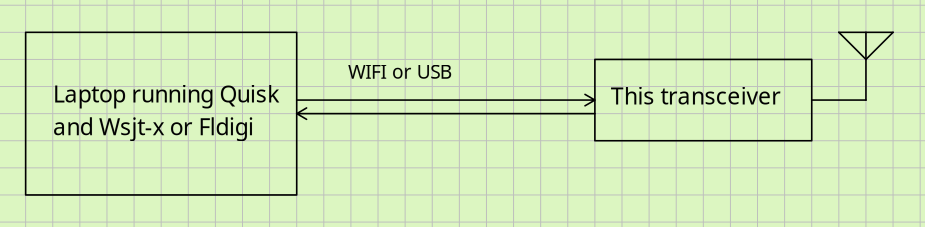
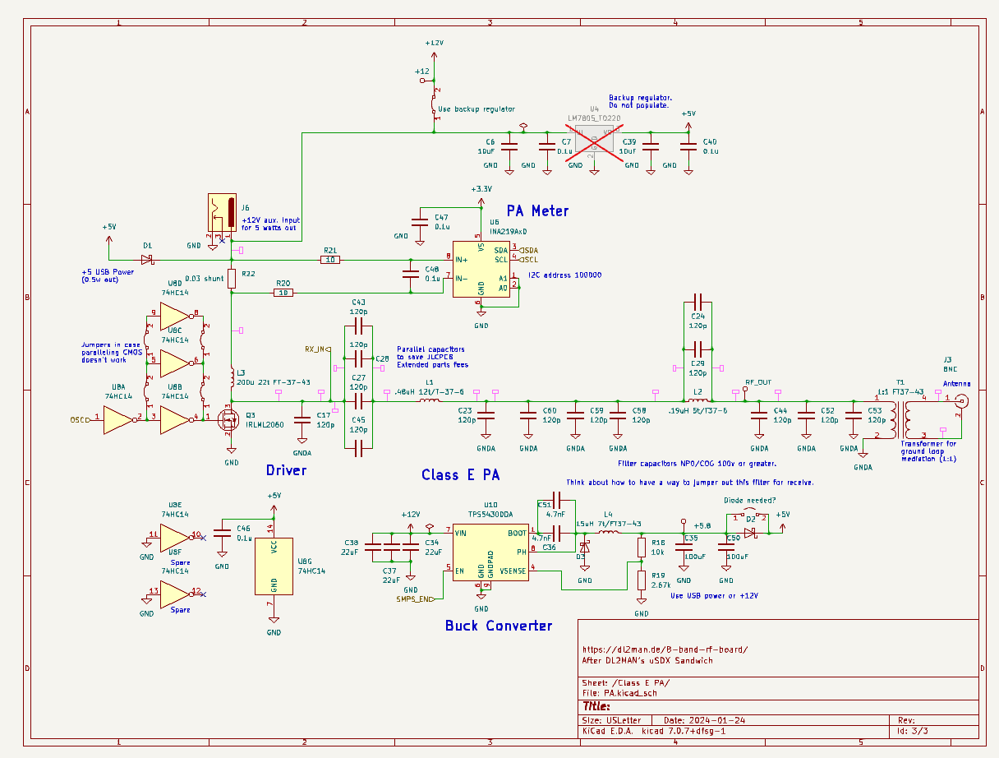
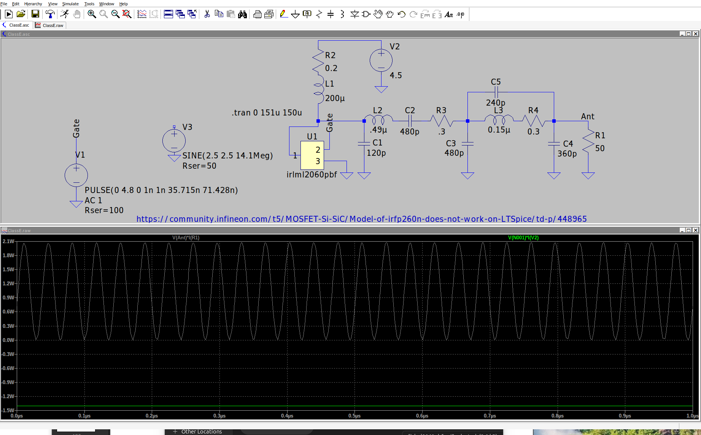
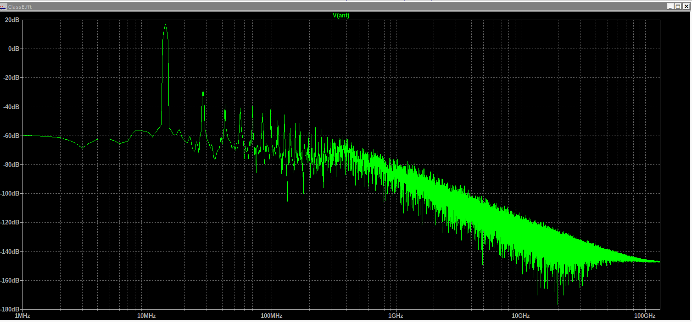
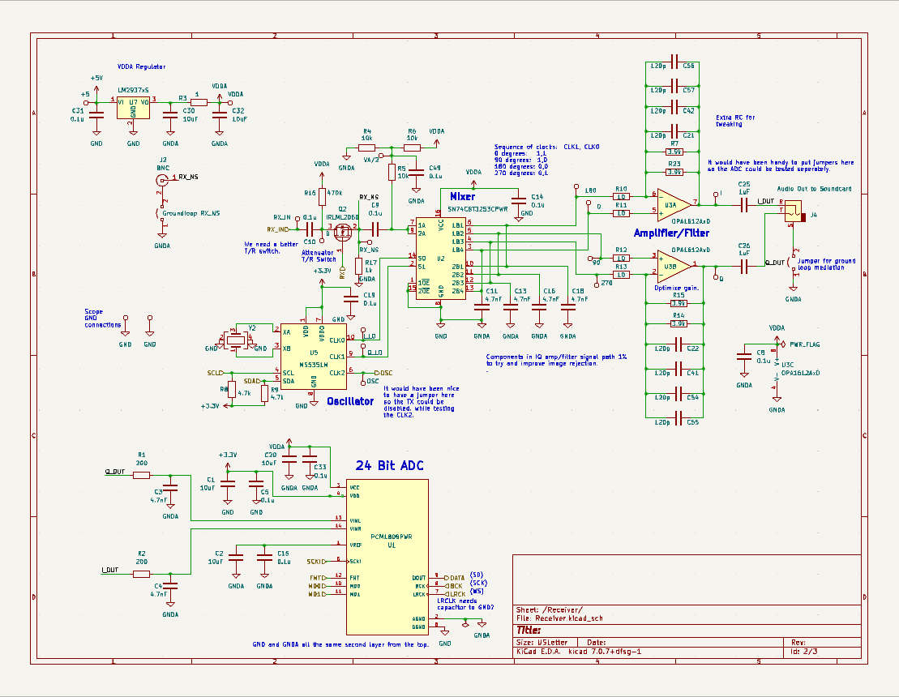
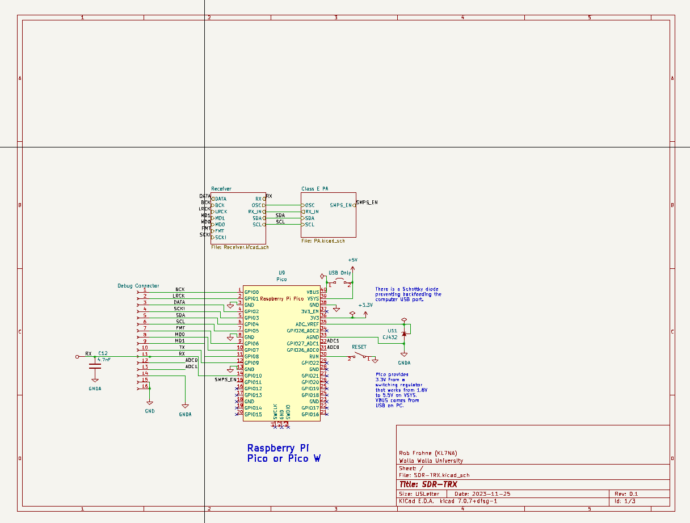
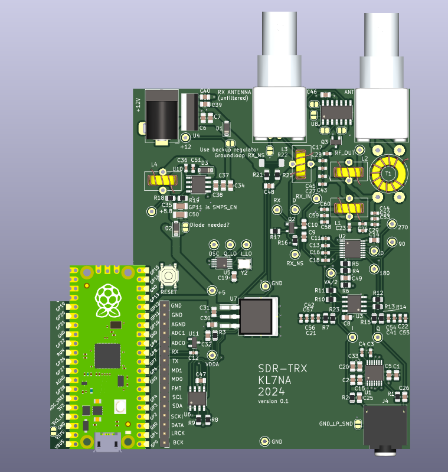

# SDR-TRX Digital Modes Transceiver, 2023-2024
## Philosophy and Design Goals
This SDR is a prototype hardware platform to assist in developing a low-cost transceiver for digital modes (FT8, JSTcall, WSPR, CW, etc) that do not require linear amplification like SSB.  This is designed for amateur radio enthusiasts who view their hobby as an avenue for experimenting, who like building things, have an interest in HF radio propagation.  The idea is to use a laptop and mainstream (actively maintained) existing software as the display and for the DSP needed.  The hardware described here will fill out the rest of the transceiver.  The assumption is that most hams will have a PC of some kind already, and this is an easy and cheap way to get on the air using the digital modes and their PC.
I am also using this as a platform to demonstrate to my students how to do an electronic design project.  It is hoped a transceiver based on this prototype platform will be inexpensive enough that third-world hams or those with few funds to spend on their hobby would find attractive.  JLCPCB built five of these for me for a little over $100.  This project is built using designs previously published and would not be possible without them.  The next section is meant to be a short review of some of the projects I found especially useful.
### Previous Work
#### Especially Relevant Work
* [WSJT-Transceiver](https://github.com/agustinmartino/wsjt_transceiver/blob/master/README.md)
* [Quisk SDR Software](https://james.ahlstrom.name/quisk/)
* [WSJT-X Low S/N Digital Mode Decoding Software](https://wsjt.sourceforge.io/)
* [Fldigi](http://www.w1hkj.com/FldigiHelp/index.html)
* [DL2MAN Sandwich](https://dl2man.de/sample-page/)
* [PE1NNZ uSDX](https://github.com/threeme3/usdx)
* [A Comparison of Affordable Self-Assembled SDR Receivers](https://fweb.wallawalla.edu/~frohro/ClassHandouts/Electronics/A%20Comparison%20of%20Affordable,%20Self-Assembled%20%20Software-Defined%20Radio%20Receivers%20Using%20Quadrature%20Sampling%20Down-Conversion.pdf)
* [QRP Labs QDX Transceiver](https://www.qrp-labs.com/qdx.html) (This transceiver is quite similar.)
#### More General but Useful Work
*  [Easy-Transceiver](https://github.com/kholia/Easy-Transceiver])
* [Etherkit JTEncode](https://github.com/etherkit/JTEncode)
* [Etherkit Si5351](https://github.com/etherkit/Si5351Arduino)

###
The basic block diagram showing how this SDR interfaces with a PC is shown below.

A clone of the Silicon Labs, Si5351a, the MS5351M is used as the local oscillator for the QSD down converter.  The resultant audio frequency data is sent to the PC where Quisk demodulates it and sends it on to WSJT-X or Fldigi for decoding.  The MS5351M's third oscillator is used to generate the digital signals on transmit.  These signals are amplified by a class E circuit for the 20-meter band.  Throughout the unit, there are features that provide stepping stones toward the final goal.  For example, an output is provided to allow the sound data to be sent to the PC where a sound card on the PC converts the sound signal to digital samples.  A Raspberry Pi Pico or Pico W is used on the SDR to control the MS5351M local oscillator and exciter, sample the receiver audio data using a PCM1808 ADC, and send the sampled data to the PC for processing.  It also receives transmit data from the PC to allow transmission of the digital signals desired.

The Kicad project SDR-TRX contains the hardware documentation, including the schematic diagram and the printed circuit board.  The software is still in development.

##  Transmitter 
The MS5351M, a Si5351a clone, generates a digitally transmitted signal (and the harmonics you expect) on its third output.  It is used to drive a set of CMOS inverters that in turn drive a MOSFET class E amplifier for 20 meters. 

### Class E Amplifier
The design started with the DL2MAN sandwich Class E amplifier for 20 meters.  LTspice was employed to try and minimize the number of values of Extended Parts capacitors needed from JLCPCB while still maintaining a decent efficiency, power output, and harmonic attenuation.  The value of the capacitor that seemed to be best was a 120 pF 100V 1% COG multilayer monolithic capacitor.  We paralleled a bunch to make the amplifier we ended up with.  It was chosen first for harmonic suppression, second for power output, and lastly for efficiency, with the constraint of using only one value of capacitor.  The simulation has about 50 dB of harmonic attenuation, about a watt of output, and an efficiency of 75%.  See the simulation below which is called Class E.asc in the SDR 2023 Docs.

This simulation shows the efficiency and output power.

This is the FFT of the antenna voltage.

There is an I2C voltage and current monitor, the INA219A, that should allow measuring the DC power used by the class E amplifier so LTspice simulations can be verified for accuracy easily.

## Receiver
The receiver used was the [QSD Tayloe-type](https://www.norcalqrp.org/files/Tayloe_mixer_x3a.pdf) design using both inverting and inverting inputs.  The inverting input has a lower input impedance and so is more of a current amplifier.  The non-inverting amplifier has a high input impedance, and so acts as a voltage amplifier.  The low-frequency gain of the inverting amplifier is $\frac{-R_f}{R_i}$ and the non-inverting amplifier has a gain of $ 1 + \frac{R_f}{R_i}$ so the CMRR is  not as good as a fully differential amplifier, but we are just trying to amplify the signal not null out any common mode signal.  We need to keep the DC to $\frac {4.5V}{2}$ and the $1$ term perfectly does this for us for the common mode DC voltage.  There is a gain for the mixer of $1/4$ because the state space average of the switched voltage at the output of the mixer is a quarter of the input voltage.  The gain is initially set to about 20 between the antenna and I or Q.  These signals go into the soundcard or the onboard ADC, a PCM1808.

The MS5351M generates in-phase and quadrature signals for the SN74CBT3253 four-to-one analog switch mixer.

The sampling capacitors provide a low pass filter for the signal, and the cutoff frequency is $1/(2\pi R_f 4 C)$.  The factor of four comes about because the sampling capacitors only get charged a quarter of the time, or equivalently, there are four of them to charge.  The resistance, $R_i$, is the antenna impedance plus the 10 ohms on the inverting input.  The feedback capacitors, $C_f$ add another pole of low pass filter to the signal.  The cutoff frequency of these filters is $1/(2\pi R_f C_f)$.

There are two antenna inputs (BNC connectors), one on a transmit/receive switch that uses the Class E filter to try and filter the received signal, and another one that bypasses the filter that can be used when we want to listen to more than just 20 meters.  It can also suffice to do real-world testing to see which is preferable.

An LDO linear regulator powered by the USB 5 volts or the external 12-volt power supply provides a 4.5 volt low noise power for the analog parts in the receiver.  When the 12-volt input is used the USB power supply is disconnected by some Schottky diodes and two possible regulators drop the voltage to about 5.8 volts to run the rest of the radio except the class E PA stage.  These are selected by an I/O line from the processor or by not populating the undesired supply.  The two options are an SMPS buck regulator or a 7805 linear regulator that is not as efficient but should not produce switching noise. We will experiment to see which we like and choose that one.

There are several ground loop suppression strategies available.  The filtered antenna uses a transformer.  In other places, a jumper is provided to allow a single ground connection through the power supply.  

## Control Circuitry
The control of the SDR comes from the operator via the PC interface software (Quisk, for example), which sends the data to the SDR via USB UART or via WIFI.  The MCU that we chose is the Raspberry Pi Pico or Pico W if WIFI is desired.  It controls the MS5351M programmable oscillator using I2C and uses the INA219 to measure the current and voltage of the power amplifier.  It also reads the ADC via I2S and transfers that data to the PC where Quisk or a similar program demodulates it.  The only software running at this time is a rudimentary I2S control for the ADC, and software to set the oscillator frequency using Quisk.  Sending the ADC data back to the PC and ensuring the sample rate is correct (probably by dropping a few samples every so often) still needs to be programmed and the software to tell the Pico what the MS5351M needs to do for transmitting all need to be programmed.  Transferring ADC data from the PCM1808 to the computer requires a faster programming language that MicroPython unfortunately, so we are using C++ and the Earl E. Philhower, (Arduido-Pico)[https://arduino-pico.readthedocs.io/en/latest/index.html] development library.  The easiest way to get started is to use the Arduino IDE, but VScode with Github Copilot there are a lot more features.  You have to [read how to make the Arduino-Pico](https://arduino-pico.readthedocs.io/en/latest/platformio.html) code work with VScode.

### PCB
The PCB has test points and uses components I found still available on JLCPCB.  That accounts for why a mix or 0603 and 0805 components, and why there are a lot of 120pF and 4.7nF caps in parallel.

The cutout is for the WIFI antenna if a Pico W is used.
